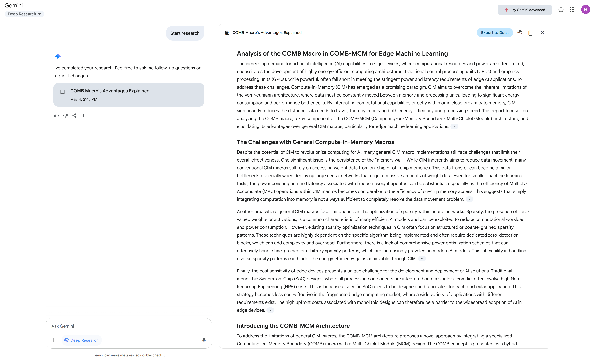

# Cihlab-entry-2025-JiaYutong
 The answer of problems in cihlab-entry tasks.

## Google Gemini Deep Reserch Using Report

I ask Google Gemini the following question with deep reserch feature:

*Why is the COMB macro in the COMB-MCM paper better than general Compute-in-Memory macros?*

These are screen captures I get during this process:

Then I get the following result:

# Analysis of the COMB Macro in COMB-MCM for Edge Machine Learning

The increasing demand for artificial intelligence (AI) capabilities in edge devices, where computational resources and power are often limited, necessitates the development of highly energy-efficient computing architectures.1 Traditional central processing units (CPUs) and graphics processing units (GPUs), while powerful, often fall short in meeting the stringent power and latency requirements of edge AI applications. To address these challenges, Compute-in-Memory (CIM) has emerged as a promising paradigm. CIM aims to overcome the inherent limitations of the von Neumann architecture, where data must be constantly moved between memory and processing units, leading to significant energy consumption and performance bottlenecks.1 By integrating computational capabilities directly within or in close proximity to memory, CIM significantly reduces the distance data needs to travel, thereby improving both energy efficiency and processing speed. This report focuses on analyzing the COMB macro, a key component of the COMB-MCM (Computing-on-Memory Boundary - Multi-Chiplet-Module) architecture, and elucidating its advantages over general CIM macros, particularly for edge machine learning applications.1

## The Challenges with General Compute-in-Memory Macros

Despite the potential of CIM to revolutionize computing for AI, many general CIM macro implementations still face challenges that limit their overall effectiveness. One significant issue is the persistence of the "memory wall".1 While CIM inherently aims to reduce data movement, many conventional CIM macros still rely on accessing weight data from on-chip or off-chip memories. This data transfer can become a major bottleneck, especially when deploying large neural networks that require massive amounts of weight data. Even for smaller machine learning tasks, the power consumption and latency associated with frequent weight updates can be substantial, especially as the efficiency of Multiply-Accumulate (MAC) operations within CIM macros becomes comparable to the efficiency of on-chip memory access.1 This suggests that simply integrating computation into memory is not always sufficient to completely resolve the data movement problem.

Another area where general CIM macros face limitations is in the optimization of sparsity within neural networks.1 Sparsity, the presence of zero-valued weights or activations, is a common characteristic of many efficient AI models and can be exploited to reduce computational workload and power consumption. However, existing sparsity optimization techniques in CIM often focus on structured or coarse-grained sparsity patterns. These techniques are highly dependent on the specific algorithm being implemented and often require dedicated zero-detection blocks, which can add complexity and overhead. Furthermore, there is a lack of comprehensive power optimization schemes that can effectively handle fine-grained or arbitrary sparsity patterns, which are increasingly prevalent in modern AI models.1 This inflexibility in handling diverse sparsity patterns can hinder the energy efficiency gains achievable through CIM.

Finally, the cost sensitivity of edge devices presents a unique challenge for the development and deployment of AI solutions. Traditional monolithic System-on-Chip (SoC) designs, where all processing components are integrated onto a single silicon die, often involve high Non-Recurring Engineering (NRE) costs.1 This is because a specific SoC needs to be designed and fabricated for each particular application. This strategy becomes less cost-effective in the fragmented edge computing market, where a wide variety of applications with different requirements exist. The high upfront costs associated with monolithic designs can therefore be a barrier to the widespread adoption of AI in edge devices.

## Introducing the COMB-MCM Architecture

To address the limitations of general CIM macros, the COMB-MCM architecture proposes a novel approach by integrating a specialized Computing-on-Memory Boundary (COMB) macro with a Multi-Chiplet Module (MCM) design.1 The COMB concept is presented as a hybrid strategy that lies between traditional in-memory computing and near-memory computing.1 This "computing-on-memory-boundary" aims to strike a balance that achieves high macro computing energy efficiency while keeping the overall system power overhead low. The MCM aspect of the architecture involves using multiple smaller chiplet modules that are interconnected within a single package, instead of relying on a single large monolithic die.1 This modular design offers several potential advantages, including improved scalability to support AI tasks with varying levels of complexity. By configuring the number of chiplets, the system's computational and memory resources can be adjusted proportionally to the demands of the application.11 Furthermore, the MCM approach can potentially lead to reduced manufacturing costs due to the higher yield rates associated with smaller silicon dies compared to large monolithic chips.13 Additionally, designing and verifying smaller chiplets can accelerate the overall design cycle compared to the lengthy process of developing a complex monolithic SoC.1 This shift towards modularity in AI accelerator design reflects a broader trend in the semiconductor industry driven by the slowing of Moore's Law, where scaling monolithic chips is becoming increasingly challenging and expensive.1

## Advantages of the COMB Macro over General CIM Macros

The COMB macro within the COMB-MCM architecture offers several key advantages over general CIM macros, particularly in addressing the challenges previously discussed. One of the primary benefits of the "computing-on-memory-boundary" approach is its potential to further mitigate the memory wall issue.1 By strategically placing processing units nearer to the memory compared to traditional CIM processors, the COMB macro aims to reduce the communication costs associated with data transfer. This proximity minimizes the distance that data needs to travel, which can lead to lower latency in accessing the necessary information and reduced power consumption for data movement. This design philosophy acknowledges that while in-memory computation offers the ultimate theoretical reduction in data movement, a more practical approach that balances computation locality with memory access efficiency might be optimal for certain applications, especially in edge devices.

Furthermore, the COMB macro incorporates a "bipolar bitwise sparsity optimization" technique.1 This method aims to provide more efficient power management compared to general CIM sparsity techniques. By operating at the bit level, this optimization can potentially achieve finer granularity in identifying and exploiting sparsity in the weight data. The term "bipolar" likely refers to the ability of this technique to efficiently handle both positive and negative weight values, which are common in neural networks. This contrasts with some general CIM sparsity methods that might be limited to coarser levels of granularity or struggle with signed values. By effectively leveraging bitwise sparsity, the COMB macro can potentially achieve significant reductions in power consumption by only processing the non-zero bits, leading to improved energy efficiency for AI inference tasks.

The closer integration of processing units and memory in the COMB macro directly contributes to higher macro computing energy efficiency and lower system power overhead.1 The reduced communication distances not only lower the energy required for data transfer but also enable faster operation. This combination of efficient computation and reduced power consumption makes the COMB macro a compelling solution for energy-constrained edge devices where battery life and thermal management are critical concerns.

## Performance and Efficiency Comparison

While the specific performance details of the COMB macro are not extensively detailed in the provided snippets, related research offers valuable insights. A processing near-memory system presented by Alibaba and Fudan University at ISSCC 2022, which likely introduced the COMB concept, achieved an energy efficiency of 32.9 TOPS/W while performing computations with INT3 precision on an SRAM-based near-memory computing architecture.1 This demonstrates a significant level of energy efficiency, particularly for edge applications. Furthermore, it was noted that achieving 90% input sparsity could further boost the energy efficiency to 46.4 TOPS/W 1, highlighting the effectiveness of sparsity exploitation in this architecture.

It is important to note that other general CIM macros also report impressive energy efficiency figures. For example, a digital NVM CIM macro (DNV-CIM) achieved up to 39.9 TOPS/W when running a 4-bit quantized ResNet18.1 Additionally, a 65nm drive strength-based SRAM Compute-In-Memory macro achieved 687.5 TOPS/W.25 These examples, along with the numerous other CIM macros listed in resources like the Literatures-on-SRAM-based-CIM repository 25, indicate that the field of CIM is rapidly advancing, with various approaches achieving high levels of energy efficiency. Therefore, while the COMB architecture demonstrates strong performance in terms of TOPS/W, the claim of superiority over all general CIM macros requires a more nuanced understanding based on specific application requirements, precision levels, and other architectural trade-offs. The performance metrics of the COMB architecture, particularly its energy efficiency, strongly suggest its potential for edge machine learning applications. The low power overhead and high energy efficiency are crucial for devices operating on limited power budgets. Moreover, the scalability offered by the MCM design allows for tailoring the hardware resources to the specific computational demands of different edge AI tasks by adjusting the number of integrated chiplets.1 This flexibility is essential for the diverse range of AI applications envisioned for edge computing environments.

## Suitability for Edge Machine Learning Applications

The features of the COMB-MCM architecture make it particularly well-suited for the unique demands of edge machine learning applications.1 The low system power overhead inherent in the COMB design is a critical advantage for battery-powered or thermally constrained edge devices. The reported high energy efficiency further reinforces its suitability for such environments, allowing for more complex AI tasks to be performed within tight power budgets.

The scalability provided by the MCM design is also highly beneficial for edge computing. Different edge AI applications, ranging from simple sensor data processing to complex video analytics, have vastly different computational requirements. The ability to adjust the number of chiplets in the COMB-MCM architecture allows developers to create systems that are appropriately sized and powered for the specific task at hand, avoiding the inefficiencies of using an over-specified monolithic chip for simpler tasks or the limitations of an undersized chip for more demanding ones.1 This modularity also contributes to the potential cost-effectiveness of the architecture, making high-performance AI accessible to a wider range of edge applications.

## Conclusion

The COMB macro within the COMB-MCM architecture presents a compelling solution for energy-efficient AI acceleration, particularly for edge computing. Its computing-on-memory-boundary approach aims to mitigate the memory wall issue by reducing communication costs, while the bipolar bitwise sparsity optimization offers the potential for fine-grained power management. The integration of these features within a scalable Multi-Chiplet Module design further enhances its suitability for the diverse and resource-constrained landscape of edge machine learning applications. While the reported performance metrics demonstrate strong energy efficiency, it is important to acknowledge that other general CIM approaches also exhibit competitive performance. Therefore, determining the absolute superiority of the COMB macro may depend on the specific requirements of the target application and would benefit from a more detailed comparison based on the full research paper. Nevertheless, the architectural innovations and performance characteristics of COMB-MCM strongly position it as a significant advancement in the pursuit of efficient AI inference at the edge.

**Table 1: Comparison of General CIM Macros and COMB Macro**

| **Feature**            | **General CIM Macros**                                       | **COMB Macro (COMB-MCM)**                                    |
| ---------------------- | ------------------------------------------------------------ | ------------------------------------------------------------ |
| Memory Wall Mitigation | Variable; may still involve significant on/off-chip data transfer. | Computing-on-memory-boundary aims for lower communication costs. |
| Sparsity Optimization  | Often structured or coarse-grained; may require explicit zero-detection. | Bipolar bitwise sparsity optimization for potentially finer-grained power optimization. |
| Architecture           | Typically monolithic SoC or various forms of near/in-memory computation. | Computing-on-memory-boundary with Multi-Chiplet Module (MCM) integration. |
| Scalability            | Can be limited in monolithic designs.                        | Enhanced through MCM design by adjusting the number of chiplets. |
| Cost-Effectiveness     | Monolithic SoCs can have high NRE costs, especially for diverse applications. | Potential for reduced costs through higher yields of smaller chiplets in MCM. |

**Table 2: Performance Comparison**

| **Metric**              | **COMB Architecture (ISSCC 2022)** | **Example General CIM Macro 1 (DNV-CIM)** | **Example General CIM Macro 2 (ISSCC 2023 Macro)** |
| ----------------------- | ---------------------------------- | ----------------------------------------- | -------------------------------------------------- |
| TOPS                    | 0.97                               | N/A                                       | Variable (e.g., 38-102)                            |
| TOPS/W                  | 32.9                               | 39.9                                      | Variable (e.g., 38-102)                            |
| Precision               | INT3                               | 4-bit                                     | 8-bit                                              |
| Memory Type             | SRAM-based near-memory             | NVM (SONOS)                               | SRAM                                               |
| Input Sparsity (for EE) | 50% (32.9 TOPS/W), 90% (46.4)      | N/A                                       | N/A                                                |